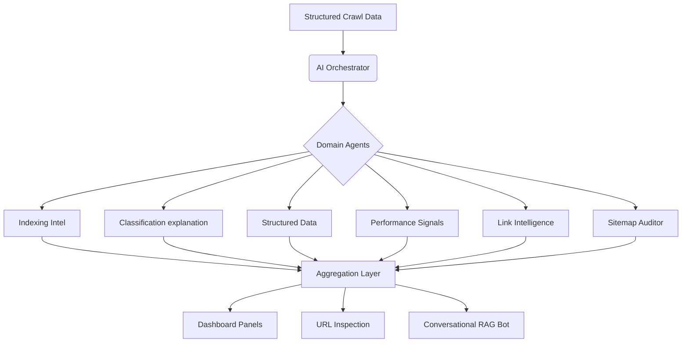
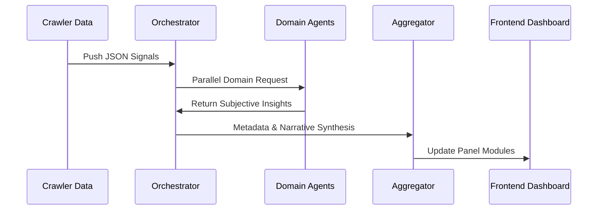

# AI Agent Structure – Website Intelligence Dashboard

> **Scope:** AI Interpretation Layer & Human-Readable Insight Generation.  
> **Constraint:** Leverages structured crawl data; does NOT perform raw crawling.

---

## Overview

This document defines the AI agent architecture for a crawler-driven website intelligence system designed to power a Google Search Console-like dashboard. The AI layer interprets structured crawl data, explains complex patterns, and generates human-readable narratives for marketing, SEO, and product teams.

**Core Principle:**
> Crawler = Facts | AI Agents = Interpretation, Explanation, and Insights

---

## 1. High-Level AI Agent Architecture

The system utilizes a multi-agent orchestration pattern where a central controller routes data to domain-specific analytical agents.

---

## 2. Agent Module Specifications

### 2.1 AI Orchestrator (Central Brain)
Acts as the master controller that coordinates specialized agents and ensures unified site-level context.

| Responsibility | Detail |
| :--- | :--- |
| **Routing** | Directs relevant JSON fragments to specialized agents. |
| **Aggregation** | Merges parallel outputs into cohesive dashboard panels. |
| **Memory** | Maintains conversational context for the RAG chatbot. |
| **Normalization** | Ensures consistent tone and depth across all AI summaries. |

---

### 2.2 Indexing Intelligence Agent
Explains indexing and coverage behavior using crawler-derived signals such as robots meta, canonicals, and depth.

*   **Scope:** Indexable vs. Non-indexable patterns, Crawled but not indexed, Discovered but weak pages.
*   **Analysis:** Soft 404 detection, redirect clusters, and duplicate canonical conflicts.
*   **Example Output:** *"A large portion of non-indexed pages are low-content sections with high crawl depth and weak internal linking."*

---

### 2.3 URL Classification Explanation Agent
Translates technical URL states into human-readable explanations.

*   **Supported States:** Crawled-Not-Indexed, Discovered-Not-Indexed, Excluded by Noindex, Redirected, 404 Not Found.
*   **Outcome:** Clear, non-technical definitions of "why" a URL is in a specific bucket and the resulting business impact.

---

### 2.4 Structured Data & Enhancements Agent
Analyzes JSON-LD validity and optimization opportunities across the site.

*   **Scope:** Breadcrumbs, FAQ, Product, Review snippets, and Organization schema.
*   **Analysis:** Identifies missing schema opportunities and explains unprocessable data errors.
*   **Insight Example:** *"Most product pages lack valid Price schema, leading to poor rich result eligibility."*

---

### 2.5 Link Intelligence Agent
Maps the internal link ecosystem to explain authority flow and discoverability.

*   **Scope:** Internal/External distribution, Orphan pages, Authority silos.
*   **Key Logic:** Correlates link depth with indexing status to find "buried" strategic pages.
*   **Insight Example:** *"Strategic service pages are buried at Depth 5+, receiving 80% less link equity than blog archives."*

---

### 2.6 Performance & Web Signal Interpreter
Interprets crawl-time performance signals (Latency, TTFB, Asset Weight).

*   **Logic:** Clusters slow pages by template or directory rather than individual URLs.
*   **Thresholds:** Flags weight-heavy templates (large images/scripts) affecting crawl efficiency.

---

### 2.7 URL Inspection Agent (Deep Dive)
Powers the individual "URL Inspection" feature with single-page narrative intelligence.

| Metric | Interpretation |
| :--- | :--- |
| **Depth** | Analyzes how many clicks from home it takes to reach the page. |
| **Health** | Summarizes technical status, canonicals, and indexability. |
| **Discovery** | Explains exactly how the crawler found the URL (Sitemap vs Link). |

---

## 3. The Website Insight Narrator (Executive Layer)

This agent generates high-level, marketing-friendly summaries for the main dashboard view. It converts raw metrics into **strategic storytelling.**

*   **Content Patterns:** "The site is dominated by thin categorical pages."
*   **Technical Health:** "Indexation is healthy, but structural depth is hindering new content discovery."
*   **Opportunities:** "Optimizing the footer link structure could surface 500+ orphan pages."

---

## 4. Conversational Chatbot (RAG Agent)

Enables natural language querying of the crawl dataset without hallucinations.

*   **Architecture:** Retrieval-Augmented Generation (RAG) over the structured crawl database.
*   **Safety:** Grounded strictly in factual crawl signals and agent-generated summaries.
*   **Supported Queries:** "Why are my blog pages not indexing?" or "Show me all pages missing FAQ schema."

---

## 5. Intelligence Data Flow

---

## 6. Key Design Principles

1.  **Explanation First:** Avoid raw scores; prioritize explaining the *reasoning* behind the metric.
2.  **Modular Scalability:** New agents (e.g., Core Web Vitals Agent) can be plugged in without refactoring.
3.  **Deterministic Grounding:** AI interpretation is always tied to a physical crawl signal (no hallucinated URLs).
4.  **Cluster Analysis:** Focus on page templates and directories rather than individual URL noise.

---

## 7. Final Summary

The AI agent system acts as the **Intelligence Translation Layer** between raw crawl data and the end-user. By specializing in specific domains like Indexing, Links, and Enhancements, the system provides a Google Search Console-like experience that is explainable, actionable, and grounded in site-wide facts.
