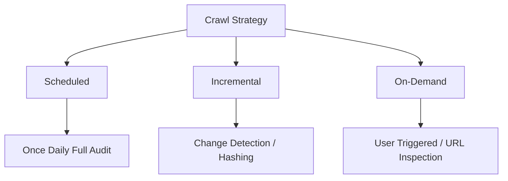

# Crawling Strategies – Web Crawler System

> **Objective:** Maximum Coverage, Controlled Resource Usage, and Real-Time Intelligence.  
> **Approach:** Hybrid multi-tier crawling methodology.

---

## Overview

This document defines the crawling strategies for a large-scale website crawler designed for deep coverage, efficiency, and real-time dashboard updates. The focus is on intelligent patterns, prioritization, and on-demand auditing for high-density environments.

---

## 1. Core Crawling Philosophy

The system rejects "blind" full-site crawling in favor of a hybrid model that balances freshness with resource efficiency.

---

## 2. Breadth-First Search (BFS) Traversal

The crawler utilizes a **BFS traversal model** to ensure balanced and structured website coverage, prioritizing the most important pages (shallowest) first.

### BFS Hierarchy
- **Depth 0:** Homepage (Entry Point).
- **Depth 1:** Primary Navigation & Core landing pages.
- **Depth 2:** Category & Main Content pages.
- **Depth 3+:** Deep Internal links & Paginated archives.

### Traversal Benefits
*   **Safety:** Naturally resists getting trapped in deep URL loops (e.g., infinite calendars).
*   **Priority:** Matches search engine patterns by discovering high-equity pages first.
*   **Structure:** Simplifies the "Frontier" queue management with depth-aware scheduling.

---

## 3. Crawl Modalities

### 3.1 Daily Scheduled Crawl (Primary Baseline)
Establishes a reliable baseline dataset for site-wide AI analysis.
*   **Frequency:** Every 24 hours.
*   **Scope:** Full domain crawl (within depth limits), Sitemap reconciliation, and Link Graph refresh.

### 3.2 Incremental Crawling (Change Detection)
Reduces computational overhead by skipping unchanged content.
*   **Logic:** Uses content hashing to detect delta changes.
*   **Triggers:** `lastmod` sitemap updates, new URL discovery, or significant hash mismatches in sampled pages.
*   **Impact:** Reduces redundant crawls by 70–90%.

### 3.3 On-Demand Crawling (High-Priority)
Allows users to trigger immediate audits for specific needs.
| Type | Use Case | Characterstics |
| :--- | :--- | :--- |
| **Site Audit** | Website redesign or migration. | Asynchronous, background processing. |
| **URL Inspection** | Validating technical fixes (e.g., 404 fix). | Instant, lightweight refresh. |
| **Sectional Crawl** | Auditing specific directories (e.g., `/blog/*`). | Targeted, high-speed discovery. |

---

## 4. Priority-Aware Frontier Management

The "URL Frontier" (Queue) assigns dynamic priority scores to balance discovery speed.

### Priority Ranking (High to Low)
1.  **Sitemap Entries:** Known "clean" URLs declared by the site owner.
2.  **Home & Navigation:** Core hubs of site equity.
3.  **Recent Updates:** Pages with new `lastmod` or detected changes.
4.  **High-Link Hubs:** Pages with significantly high internal link counts.
5.  **Parameters/Filters:** Faceted navigation and filtered views (lowest priority).

---

## 5. Stability & Politeness Controls

### 5.1 Smart Recrawl Tiers
Instead of uniform recrawling, the system applies tiered frequencies:

| Page Category | Recrawl Frequency | Rationale |
| :--- | :--- | :--- |
| **Hubs & Key Pages** | Multiple times / Daily | Most likely to change or host new links. |
| **Update-Active Pages** | Daily | Standard content updates. |
| **Static & Archival** | Weekly | Low change probability. |
| **Deep Archives** | Periodic / On-demand | Resource intensive, low immediate value. |

### 5.2 Crawl Budget & Limits
*   **Depth Constraints:** Configurable limits (e.g., max Depth 7) to prevent infinite sprawl.
*   **Total URL Caps:** Hard limits per session to control infrastructure costs.
*   **Concurrency:** Throttled requests per domain to ensure server politeness.
*   **Failure Management:** Exponential backoff for 5xx errors or connection timeouts.

---

## 6. Large-Scale Link Graph Optimization

For sites with millions of internal links, the crawler implements:
*   **Deduplication:** Hash-based URL comparison.
*   **Template De-weighting:** Ignoring repetitive headers/footers to find unique content links.
*   **normalization:** Standardizing trailing slashes and parameter casing.
*   **Loop Protection:** Detecting and killing infinite pagination loops.

---

## 7. Final Strategy Summary

The crawling strategy integrates **BFS-based discovery** with a **Priority Queue Frontier** to achieve deep site coverage without excessive resource waste. By layering scheduled full audits with incremental change detection and user-triggered inspections, the system maintains a fresh, high-fidelity intelligence dataset suitable for professional GSC-style dashboards.
