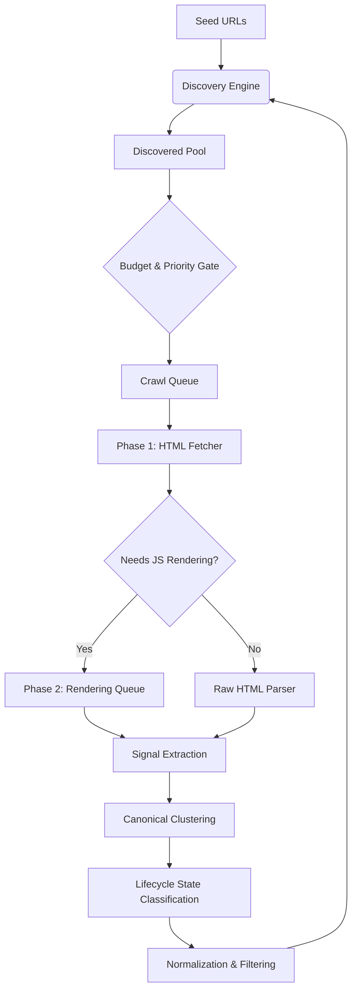
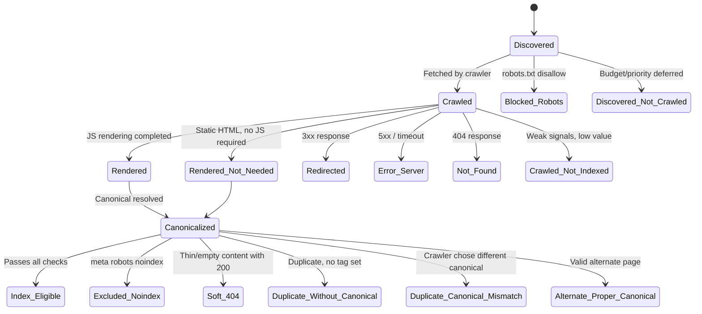

# Web Crawler Engine – Complete Specification (Crawler Only)

> **Focus:** Deep Crawling Architecture, Discovery, and Logic.  
> **Exclusions:** Backend Services, Databases, Dashboards, Frontend.

---

## Overview

This document defines the complete design and functionality of a production-grade web crawler engine. It focuses exclusively on crawling architecture, discovery, fetching, parsing, and crawl logic.

**Goal:**
> Discover → Classify → Crawl → Render → Parse → Extract Crawl Signals → Classify Lifecycle State → Queue Next URLs

> [REVISED] The goal pipeline now explicitly includes lifecycle classification as a first-class crawl output rather than a post-hoc metric.

---

## 1. Core Purpose of the Web Crawler

A web crawler is an automated system that systematically browses and fetches web pages to:

*   **Discover** all URLs on a website.
*   **Crawl** internal and external links.
*   **Parse** HTML and rendered content.
*   **Extract** crawl-level signals (links, metadata, assets).
*   **Monitor** site structure and changes over time.
*   **Classify** every URL into a GSC-compatible lifecycle state. [NEW]

This crawler is designed for deep website crawling similar to search engine bots. It is **Googlebot-inspired, not Googlebot-impersonating**: it mirrors the observable behaviors and classification logic of Google Search Console without claiming actual Google indexing or ranking.

---

## 2. High-Level Crawler Flow

The engine follows a continuous loop from seed discovery to link extraction.

> [REVISED] The flow now includes a two-phase architecture (HTML fetch + deferred rendering), explicit lifecycle classification, and the discovered pool / crawl queue separation.



---

## 3. Seed Inputs (Starting Points)

The crawler begins with trusted seed sources to define the initial crawl surface.

| Source Type | Examples |
| :--- | :--- |
| **Primary Domain** | `https://example.com` |
| **Sitemaps** | `/sitemap.xml`, `/sitemap_index.xml` |
| **Rules** | `/robots.txt` |
| **Manual** | Custom URL lists |

---

## 4. URL Discovery Engine

### Purpose
Continuously discover new URLs from multiple crawl sources instead of relying only on hyperlinks.

### Discovery Sources
*   XML sitemaps & Sitemap index files.
*   Internal anchor links (`<a href>`).
*   Canonical tags & Pagination links.
*   Navigation menus & Footer links.
*   JavaScript-rendered links & Redirect targets.

### Responsibilities
*   **Extraction:** Identification of raw URLs.
*   **Normalization:** Path standardization.
*   **Filtering:** Removal of duplicates or non-crawlable paths.
*   **Scope Management:** Maintaining crawl within allowed domains.

### Discovery Source Attribution [NEW]

Every discovered URL must record its provenance for downstream URL Inspection and AI explanations.

| Field | Description |
| :--- | :--- |
| `discovery_source_first` | The initial mechanism that surfaced this URL (e.g., `sitemap`, `internal_link`, `canonical_tag`, `redirect`, `manual_seed`). |
| `discovery_sources_all` | An ordered list of every distinct mechanism that has ever surfaced this URL across crawl sessions. |

These fields feed directly into the URL Inspection Agent, enabling outputs such as *"This URL was first discovered via the sitemap on 2026-02-25 and later confirmed through internal links from 3 pages."*

---

## 5. URL Frontier (Crawl Queue System)

### Purpose
Acts as the brain of the crawler, managing which URLs to crawl and when.

> [REVISED] The frontier is now split into two logical stages: a **Discovered Pool** and a **Crawl Queue**. This separation is the architectural foundation for the "Discovered – Not Crawled" lifecycle state.

### Discovered Pool vs. Crawl Queue [NEW]

```text
                       ┌──────────────────────────┐
   Discovery Engine ──>│    Discovered Pool        │  All known URLs
                       │  (may never be crawled)   │
                       └────────────┬─────────────┘
                                    │
                           Budget & Priority Gate
                                    │
                       ┌────────────▼─────────────┐
                       │       Crawl Queue         │  Eligible for fetch
                       │  (ready to be crawled)    │
                       └──────────────────────────┘
```

**Transition from Discovered Pool to Crawl Queue** is governed by:
*   Crawl budget remaining in the current session.
*   URL priority score (see Crawling Strategies for the scoring formula).
*   Host health status (see Host Health section below).
*   Politeness constraints (robots crawl-delay, domain concurrency limits).
*   Whether the URL has already been crawled in this session.

A URL that remains in the Discovered Pool at session end receives the lifecycle state `Discovered – Not Crawled`. This is intentional and measurable, not an error.

### Key Functions
*   Maintain queue of pending URLs.
*   Prevent duplicate crawling via deduplication hashes.
*   Track crawl depth and assign priorities.
*   Support re-crawling logic for updated content.
*   **Track deferral counts:** Record how many sessions a URL has been deferred without crawling. [NEW]

### URL Object Structure

> [REVISED] Extended with discovery attribution, lifecycle state, and deferral tracking.

```json
{
  "url": "https://example.com/page",
  "depth": 2,
  "priority": 0.8,
  "source": "sitemap",
  "status": "pending",
  "discovery_source_first": "sitemap",
  "discovery_sources_all": ["sitemap", "internal_link"],
  "lifecycle_state": "discovered_not_crawled",
  "sessions_deferred": 0
}
```

---

## 6. URL Lifecycle State Model [NEW – GSC Core Concept]

### Purpose

Google Search Console does not merely report crawl success/failure. It classifies every known URL into an explicit coverage state that explains *why* a URL is or is not indexed. This crawler replicates that model using only crawl-derived signals.

### State Machine



### Formal State Definitions

| State | Derivation Logic |
| :--- | :--- |
| `Discovered – Not Crawled` | URL exists in the Discovered Pool but was never fetched due to budget, priority, or politeness constraints. |
| `Crawled – Currently Not Indexed` | Page was fetched and parsed, but multiple weak signals (thin content, deep depth, low inbound links) make it unlikely to be index-worthy. |
| `Duplicate without Canonical` | Content hash matches another page, but no `rel=canonical` tag is declared on either page. |
| `Duplicate – Canonical Mismatch` | The page declares a canonical, but the crawler's truth resolution selected a different canonical (based on links, redirects, content similarity). |
| `Alternate with Proper Canonical` | The page correctly points its canonical to another URL, and the canonical target is valid. |
| `Soft 404` | HTTP 200 response with minimal textual content, error-like templates, or content identical to the site's custom 404 page. |
| `Blocked by Robots` | The URL matches a `Disallow` rule in `/robots.txt` for the crawler's user-agent. |
| `Excluded by Noindex` | The page contains `<meta name="robots" content="noindex">` or an `X-Robots-Tag: noindex` response header. |
| `Redirected Page` | The URL returned a 3xx status. The redirect target is tracked separately. |
| `Error Page (5xx / Timeout)` | The server returned a 5xx error or the request timed out after retry exhaustion. |
| `Not Found (404)` | The server returned HTTP 404. |
| `Index-Eligible` | The URL passes all checks: 200 status, indexable directives, unique canonical, sufficient content. |

### Design Rules
*   States are **derived only from crawl signals**, never from external ranking APIs.
*   States are **stored per crawl session**, enabling session-to-session comparisons.
*   The state assignment runs **after** canonical clustering, so duplicate/canonical states are accurate.

---

## 7. Two-Phase Crawling Model [NEW]

Modern search crawlers such as Googlebot do not render JavaScript inline during the initial fetch. They use a two-wave architecture:

### Phase 1: HTML Fetch (Primary Crawl Wave)

*   Fetch the raw HTML response via HTTP.
*   Extract all signals available without JS execution: links, canonical tags, meta robots, response headers, structured data in source.
*   Discover new URLs immediately from anchor tags and sitemap references.
*   Assign a preliminary lifecycle state based on HTTP response and HTML signals.

### Phase 2: Deferred JavaScript Rendering Queue

*   Pages flagged as requiring JS rendering (SPA frameworks, dynamic content markers) are placed into a **rendering queue**.
*   Rendering is asynchronous and lower priority than new HTML fetches.
*   After rendering, the DOM is re-parsed for additional link discovery, content extraction, and signal updates.
*   The lifecycle state is re-evaluated after rendering completes.

### Rendering Decision Logic

| Signal | Render? |
| :--- | :--- |
| Page contains `<noscript>` fallback with full content | No |
| Response body is a minimal shell (`<div id="root"></div>`) | Yes |
| Content-Type is not HTML | No |
| Page was previously rendered and content hash unchanged | No (skip) |
| Explicitly configured in crawl profile | Forced Yes/No |

### Benefits
*   Mirrors Googlebot's real-world rendering delay behavior.
*   Prevents rendering bottlenecks from blocking link discovery.
*   Allows the Discovered Pool to grow from Phase 1 while Phase 2 catches up.

---

## 8. Robots.txt Handling (Mandatory)

Ensure ethical and rule-compliant crawling by fetching `/robots.txt` before any page requests.

*   **Parse** disallowed paths and directories.
*   **Respect** crawl-delay directives to avoid server stress.
*   **Extract** sitemap locations declared in the robots file.
*   **User-Agent Rules:** Apply specific rules based on the crawler identity.

---

## 9. Sitemap Crawling System

Supporting multiple sitemap types for exhaustive discovery.

*   **Supported Types:** `sitemap.xml`, `sitemap_index.xml`, Image/Video sitemaps.
*   **Data Points:** Location (`loc`), Last Modified (`lastmod`), Change Frequency (`changefreq`), Priority.
*   **Special Handling:** Recursive crawling of child sitemaps in index files.

---

## 10. Fetcher Module (Page Downloader)

Download web pages and collect response-level signals.

*   **HTTP/HTTPS:** Full support for modern web protocols.
*   **Resilience:** Redirect handling, timeout management, and retry logic.
*   **Captured Data:** Status codes (200, 404, 500), Final URL, Response headers, Raw HTML, Latency.

---

## 11. Host Health & Adaptive Crawl Budget Model [NEW]

### Purpose

Googlebot dynamically adjusts its crawl rate per host based on observed server performance. This crawler replicates that behavior with a host health scoring model.

### Host Health Signals

| Signal | Weight | Description |
| :--- | :--- | :--- |
| Average response latency (last N requests) | High | Rolling average of TTFB for the domain. |
| 5xx error rate (last N requests) | Critical | Proportion of server errors in recent history. |
| Timeout rate | Critical | Proportion of requests that exceeded the timeout threshold. |
| Connection refusal count | High | TCP-level failures indicating server stress. |
| `Retry-After` header presence | Override | Explicit server instruction to back off. |

### Adaptive Behavior

```text
Host Health Score = f(latency, error_rate, timeout_rate)

Score > 0.8  →  Full concurrency (configured max)
Score 0.5-0.8 →  Reduced concurrency (50% of max)
Score 0.2-0.5 →  Minimal concurrency (single request)
Score < 0.2  →  Pause crawling for this host (exponential backoff)
```

*   Health score is recalculated every N requests (configurable window).
*   A `Retry-After` header immediately pauses the host and resets the backoff timer.
*   Host health metrics are logged per session for observability.

---

## 12. JavaScript Rendering Layer (Dynamic Sites)

Handle modern websites built with Next.js, React, or Vue.

> [REVISED] This section now represents the Phase 2 rendering queue described in section 7.

*   **Execution:** Full JS rendering for Single Page Applications (SPA).
*   **DOM Capture:** Extraction of dynamically injected links and content.
*   **Lazy Loading:** Scrolling or interacting to trigger lazy-loaded URL discovery.
*   **Queue-Based:** Rendering is deferred and asynchronous, not inline with fetching.

---

## 13. Parser Module (HTML & DOM Analysis)

Extract crawl-relevant elements from fetched pages (Raw HTML or Rendered DOM).

*   **Metadata:** Title, Meta Description, Robots meta directives.
*   **Structure:** Headings (H1-H3), Canonical links.
*   **Assets:** Images (src/alt), Scripts, CSS files.
*   **Intelligence:** Structured data (JSON-LD, Schema) and main textual content.

---

## 14. Link Extraction Engine

*   **Internal:** Navigation, breadcrumbs, content, and footer links.
*   **External:** Outbound domain tracking and anchor text analysis.
*   **Classification:** Tagging links as Internal, External, Media, or Resource (PDF/ZIP).

---

## 15. URL Normalization & Filtering

*   **Normalization:** Remove fragments (#), standardize slashes, convert relative to absolute.
*   **Filtering:** Skip non-HTTP links (`mailto:`, `tel:`), duplicates, and query-heavy junk.

---

## 16. Canonical Clustering & Truth Resolution [EXPANDED]

> [REVISED] Previously "Canonical URL Handling." This section now defines canonical clustering, conflict detection, and truth resolution logic.

### Canonical Tag Extraction
*   Extract `<link rel="canonical">` from each page.
*   Normalize the canonical URL before comparison.

### Canonical Clustering [NEW]

All URLs that share a common canonical target (directly or transitively) are grouped into a **canonical cluster**.

```text
Example Cluster:
  /products/widget         → canonical: /products/widget  (self-canonical, cluster head)
  /products/widget?ref=ads → canonical: /products/widget  (alternate)
  /products/widget?sort=a  → canonical: /products/widget  (alternate)
```

**Conflict Detection:**
When chains form (A → B, B → C), the crawler resolves to the terminal canonical (C) and flags the intermediate conflict.

### Canonical Truth Resolution [NEW]

The `rel=canonical` tag is a **hint**, not a directive. The crawler determines the true canonical by evaluating multiple signals:

| Signal | Weight | Logic |
| :--- | :--- | :--- |
| Declared `rel=canonical` tag | Medium | Starting point but can be overridden. |
| Redirect target | High | A 301 redirect to URL B strongly implies B is canonical. |
| Internal link volume | High | The URL variant receiving the most internal links is likely the canonical. |
| Content similarity hash | Medium | Near-duplicate content confirms cluster membership. |
| Sitemap inclusion | Low-Medium | URLs listed in the sitemap are presumed canonical by the site owner. |

**Resolution Output:**
*   `canonical_declared`: The URL declared by the page's tag.
*   `canonical_resolved`: The URL chosen by the crawler's truth resolution.
*   `canonical_match`: Boolean. `true` if declared equals resolved.

When `canonical_match` is `false`, the URL receives the lifecycle state `Duplicate – Canonical Mismatch`, enabling AI-generated messages such as *"Duplicate, crawler chose different canonical than user."*

---

## 17. Breadth-First Search (BFS) and Coverage Strategy

Implementing BFS allows the engine to crawl every reachable link on a website systematically, but only under specific discovery conditions.

### Systematic Discovery
BFS systematically visits all discovered URLs level by level (Homepage → Internal Links → Deeper Links). In theory, this covers the entire site graph. However, it can only crawl links that are actually discoverable and accessible. This includes links in HTML, rendered DOM, sitemaps, and navigation structures, provided they are not blocked or hidden.

### Coverage Limitations
In practice, BFS does not guarantee 100% coverage of every possible link on a server because:
*   **Robots.txt:** Paths may be explicitly blocked.
*   **Authentication:** Pages requiring login (login walls) are inaccessible.
*   **Infinite URLs:** Dynamic pagination, filters, and query parameters can create infinite traps.
*   **User Interaction:** Certain links only generate after clicks or form submissions.
*   **Orphan Pages:** Pages with no internal links remain invisible unless listed in sitemaps or seeds.
*   **JS-Heavy Content:** JavaScript may hide links unless full DOM rendering is utilized.

> **The Accurate Statement:**  
> BFS can crawl every reachable and allowed link within the defined crawl scope, not literally every existing link on the server.

### Strategies for Full Deep Coverage
To achieve maximum reach, BFS must be combined with:
*   **Sitemap Crawling:** To capture orphan or hidden URLs.
*   **JS Rendering:** To extract dynamically generated links.
*   **URL Normalization & Deduplication:** To ensure efficiency and prevent loops.
*   **Depth Limits & Loop Detection:** To manage complexity and resource usage.

---

## 18. Crawl Depth Management

*   **Rule Set:** Depth 0 (Homepage), Depth 1 (Navigation), Depth 2+ (Content).
*   **Logic:** Prevents infinite loops and infinite scrolling traps.

---

## 19. Crawl Politeness & Rate Limiting

*   **Ethics:** Respect robots.txt `crawl-delay`.
*   **Throttling:** Domain-based request limits to avoid server overload.
*   **Adaptability:** Backoff strategies on repeated failures.
*   **Host Health Integration:** Politeness is now dynamically governed by the host health score (see Section 11). [NEW]

---

## 20. Duplicate Detection & Change Detection

*   **Deduplication:** Maintain a set of visited/hashed URLs to prevent redundant work.
*   **Change Detection:** Content hash comparison to identify page updates for re-crawling.

---

## 21. Error Handling & Status Monitoring

*   **Tracking:** Monitor 404s, 500s, timeouts, and redirect loops.
*   **Logging:** Record failures for intelligent retry cycles.

---

## 22. Asset & Resource Crawling (Advanced)

*   Detection and logging of Images, CSS, JS bundles, PDFs, and Fonts.
*   Helps in mapping the full site surface area and resource dependencies.

---

## 23. URL Inspection Mode [NEW]

### Purpose
Enables on-demand, high-priority inspection of a single URL, bypassing normal frontier scheduling. This mirrors Google Search Console's "URL Inspection" tool.

### Behavior
*   **Bypass:** The URL is fetched immediately, skipping the Discovered Pool and Crawl Queue.
*   **Full Pipeline:** The URL goes through HTML fetch, optional JS rendering, signal extraction, canonical resolution, and lifecycle state classification.
*   **Isolation:** The inspection does not consume the session's crawl budget and does not alter the frontier state for ongoing sessions.
*   **Output:** Returns a detailed diagnostic payload:

| Diagnostic Field | Description |
| :--- | :--- |
| `http_status` | Response code from the live fetch. |
| `final_url` | URL after redirect resolution. |
| `canonical_declared` | The page's `rel=canonical` tag value. |
| `canonical_resolved` | The crawler's truth-resolved canonical. |
| `lifecycle_state` | The assigned GSC-compatible state. |
| `discovery_source_first` | How this URL was originally found. |
| `discovery_sources_all` | All mechanisms that have surfaced this URL. |
| `page_hash` | Current content hash. |
| `page_hash_previous` | Content hash from the last full session (if available). |
| `content_changed` | Boolean indicating whether content differs from last session. |
| `robots_status` | Whether the URL is allowed or blocked by robots.txt. |
| `rendering_required` | Whether JS rendering was triggered. |
| `structured_data_status` | `valid`, `warning`, or `invalid` per detected schema type. |

---

## 24. Continuous Crawling Strategy

*   **Recrawl Logic:** Frequency based on priority and detected change signals.
*   **Hints:** Utilizing `lastmod` from sitemaps for smart scheduling.

---

## 25. Key Design Principles

*   **Asynchronous:** Non-blocking crawl architecture.
*   **Ethical:** Strict compliance with Robots.txt and Sitemaps.
*   **Scalable:** Designed for massive URL discovery and deep site mapping.
*   **GSC-Aligned:** Every URL receives a lifecycle state classification. [NEW]
*   **Two-Phase:** HTML crawling and JS rendering are decoupled pipelines. [NEW]

---

## 26. Final Summary

This web crawler engine is a deep, intelligent crawling system that:
*   Discovers URLs from multiple sources.
*   Fetches both static and JS-rendered pages (in two phases).
*   Extracts comprehensive crawl signals.
*   Manages politeness and scheduling automatically.
*   Classifies every URL into a GSC-compatible lifecycle state.
*   Resolves canonical truth beyond simple tag extraction.
*   Adapts crawl rate based on host health.

The system is focused on **comprehensive, structured, and scalable web crawling** that produces **indexing intelligence, not just crawl statistics.**

---

## 27. Crawl Logging, Scope & Operational Controls (Addendum)

### Crawl Logging & Observability
The crawler maintains structured console logs for real-time crawl visibility and debugging.  
Each crawl event should log:
- Crawled URL and crawl depth
- HTTP status code and fetch latency
- Number of links discovered
- Redirect chains and retries
- Robots.txt blocked URLs
- Errors (timeouts, parsing failures)
- Lifecycle state assigned to the URL [NEW]
- Host health score at time of fetch [NEW]

**Log Example:**
```text
[CRAWL] URL: /blog | Depth: 2 | Status: 200 | Links: 28 | Time: 640ms | State: index_eligible
[DISCOVERY] Added 12 new URLs to discovered pool
[DEFERRED] /products?page=42 | Reason: budget_exhausted | State: discovered_not_crawled
[SKIP] Blocked by robots.txt: /admin | State: blocked_by_robots
[RENDER] Queued /app/dashboard for Phase 2 JS rendering
[HOST] example.com health=0.92 concurrency=10
[ERROR] Timeout: /products?page=10 | State: error_server
```

---

### Crawl Scope Definition
To prevent uncontrolled crawling, the engine enforces strict scope rules:
- **Default:** Same-domain crawling only.
- **Optional:** Subdomain inclusion (configurable).
- **External Links:** Discovered and logged, not recursively crawled (by default).
- **Protocols:** Non-HTTP schemes (`mailto:`, `tel:`, `javascript:`) are ignored.

---

### Crawl Budget & Limits
For stable deep crawling, the engine enforces crawl budget constraints:
- Maximum crawl depth (configurable).
- Maximum URLs per crawl session.
- Domain-level rate limits.
- Loop detection for pagination, filters, and infinite query URLs.
- **Host health gating:** A degraded host score reduces or pauses the effective budget. [NEW]

These controls prevent infinite crawling traps and ensure efficient full-site coverage.

---

### Crawl Metrics Tracking

> [EXPANDED] Metrics now distinguish between discovery, crawling, rendering, and classification stages.

The crawler continuously tracks operational metrics for coverage analysis:
- Total URLs discovered (in Discovered Pool)
- Total URLs queued for crawling (promoted to Crawl Queue)
- Total URLs crawled (HTTP response received)
- Total URLs rendered (Phase 2 JS rendering completed)
- Total URLs classified as index-eligible
- Total URLs classified as excluded (with breakdown by exclusion reason)
- Frontier (queue) size
- Success vs failed crawl ratio
- Average response time
- Depth distribution of crawled pages
- Host health score history

This telemetry ensures transparent, debuggable, and scalable deep crawling operations, and directly feeds the Crawl Coverage Metrics reported in the database layer.
