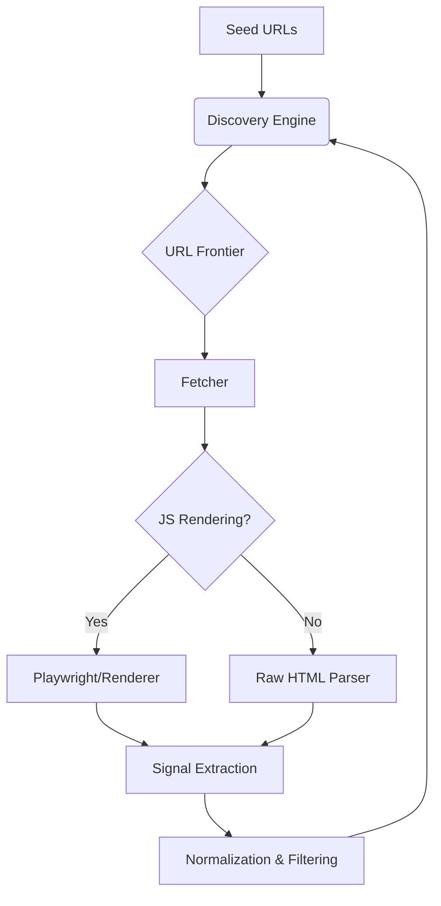

# Web Crawler Engine – Complete Specification (Crawler Only)

> **Focus:** Deep Crawling Architecture, Discovery, and Logic.  
> **Exclusions:** Backend Services, Databases, Dashboards, Frontend.

---

## Overview

This document defines the complete design and functionality of a production-grade web crawler engine. It focuses exclusively on crawling architecture, discovery, fetching, parsing, and crawl logic.

**Goal:**
> Discover → Crawl → Render → Parse → Extract Crawl Signals → Queue Next URLs

---

## 2. High-Level Crawler Flow

The engine follows a continuous loop from seed discovery to link extraction.



---

## 1. Core Purpose of the Web Crawler

A web crawler is an automated system that systematically browses and fetches web pages to:

*   **Discover** all URLs on a website.
*   **Crawl** internal and external links.
*   **Parse** HTML and rendered content.
*   **Extract** crawl-level signals (links, metadata, assets).
*   **Monitor** site structure and changes over time.

This crawler is designed for deep website crawling similar to search engine bots.

---

## 3. Seed Inputs (Starting Points)

The crawler begins with trusted seed sources to define the initial crawl surface.

| Source Type | Examples |
| :--- | :--- |
| **Primary Domain** | `https://example.com` |
| **Sitemaps** | `/sitemap.xml`, `/sitemap_index.xml` |
| **Rules** | `/robots.txt` |
| **Manual** | Custom URL lists |

---

## 4. URL Discovery Engine

### Purpose
Continuously discover new URLs from multiple crawl sources instead of relying only on hyperlinks.

### Discovery Sources
*   XML sitemaps & Sitemap index files.
*   Internal anchor links (`<a href>`).
*   Canonical tags & Pagination links.
*   Navigation menus & Footer links.
*   JavaScript-rendered links & Redirect targets.

### Responsibilities
*   **Extraction:** Identification of raw URLs.
*   **Normalization:** Path standardization.
*   **Filtering:** Removal of duplicates or non-crawlable paths.
*   **Scope Management:** Maintaining crawl within allowed domains.

---

## 5. URL Frontier (Crawl Queue System)

### Purpose
Acts as the brain of the crawler, managing which URLs to crawl and when.

### Key Functions
*   Maintain queue of pending URLs.
*   Prevent duplicate crawling via deduplication hashes.
*   Track crawl depth and assign priorities.
*   Support re-crawling logic for updated content.

### URL Object Structure
```json
{
  "url": "https://example.com/page",
  "depth": 2,
  "priority": 0.8,
  "source": "sitemap",
  "status": "pending"
}
```

---

## 6. Robots.txt Handling (Mandatory)

Ensure ethical and rule-compliant crawling by fetching `/robots.txt` before any page requests.

*   **Parse** disallowed paths and directories.
*   **Respect** crawl-delay directives to avoid server stress.
*   **Extract** sitemap locations declared in the robots file.
*   **User-Agent Rules:** Apply specific rules based on the crawler identity.

---

## 7. Sitemap Crawling System

Supporting multiple sitemap types for exhaustive discovery.

*   **Supported Types:** `sitemap.xml`, `sitemap_index.xml`, Image/Video sitemaps.
*   **Data Points:** Location (`loc`), Last Modified (`lastmod`), Change Frequency (`changefreq`), Priority.
*   **Special Handling:** Recursive crawling of child sitemaps in index files.

---

## 8. Fetcher Module (Page Downloader)

Download web pages and collect response-level signals.

*   **HTTP/HTTPS:** Full support for modern web protocols.
*   **Resilience:** Redirect handling, timeout management, and retry logic.
*   **Captured Data:** Status codes (200, 404, 500), Final URL, Response headers, Raw HTML, Latency.

---

## 9. JavaScript Rendering Layer (Dynamic Sites)

Handle modern websites built with Next.js, React, or Vue.

*   **Execution:** Full JS rendering for Single Page Applications (SPA).
*   **DOM Capture:** Extraction of dynamically injected links and content.
*   **Lazy Loading:** Scrolling or interacting to trigger lazy-loaded URL discovery.

---

## 10. Parser Module (HTML & DOM Analysis)

Extract crawl-relevant elements from fetched pages (Raw HTML or Rendered DOM).

*   **Metadata:** Title, Meta Description, Robots meta directives.
*   **Structure:** Headings (H1-H3), Canonical links.
*   **Assets:** Images (src/alt), Scripts, CSS files.
*   **Intelligence:** Structured data (JSON-LD, Schema) and main textual content.

---

## 11. Link Extraction Engine

*   **Internal:** Navigation, breadcrumbs, content, and footer links.
*   **External:** Outbound domain tracking and anchor text analysis.
*   **Classification:** Tagging links as Internal, External, Media, or Resource (PDF/ZIP).

---

## 12. URL Normalization & Filtering

*   **Normalization:** Remove fragments (#), standardize slashes, convert relative to absolute.
*   **Filtering:** Skip non-HTTP links (`mailto:`, `tel:`), duplicates, and query-heavy junk.

---

## 13. Breadth-First Search (BFS) and Coverage Strategy

Implementing BFS allows the engine to crawl every reachable link on a website systematically, but only under specific discovery conditions.

### Systematic Discovery
BFS systematically visits all discovered URLs level by level (Homepage → Internal Links → Deeper Links). In theory, this covers the entire site graph. However, it can only crawl links that are actually discoverable and accessible. This includes links in HTML, rendered DOM, sitemaps, and navigation structures, provided they are not blocked or hidden.

### Coverage Limitations
In practice, BFS does not guarantee 100% coverage of every possible link on a server because:
*   **Robots.txt:** Paths may be explicitly blocked.
*   **Authentication:** Pages requiring login (login walls) are inaccessible.
*   **Infinite URLs:** Dynamic pagination, filters, and query parameters can create infinite traps.
*   **User Interaction:** Certain links only generate after clicks or form submissions.
*   **Orphan Pages:** Pages with no internal links remain invisible unless listed in sitemaps or seeds.
*   **JS-Heavy Content:** JavaScript may hide links unless full DOM rendering is utilized.

> **The Accurate Statement:**  
> BFS can crawl every reachable and allowed link within the defined crawl scope, not literally every existing link on the server.

### Strategies for Full Deep Coverage
To achieve maximum reach, BFS must be combined with:
*   **Sitemap Crawling:** To capture orphan or hidden URLs.
*   **JS Rendering:** To extract dynamically generated links.
*   **URL Normalization & Deduplication:** To ensure efficiency and prevent loops.
*   **Depth Limits & Loop Detection:** To manage complexity and resource usage.

---

## 14. Crawl Depth Management

*   **Rule Set:** Depth 0 (Homepage), Depth 1 (Navigation), Depth 2+ (Content).
*   **Logic:** Prevents infinite loops and infinite scrolling traps.

---

## 15. Crawl Politeness & Rate Limiting

*   **Ethics:** Respect robots.txt `crawl-delay`.
*   **Throttling:** Domain-based request limits to avoid server overload.
*   **Adaptability:** Backoff strategies on repeated failures.

---

## 16. Duplicate Detection & Change Detection

*   **Deduplication:** Maintain a set of visited/hashed URLs to prevent redundant work.
*   **Change Detection:** Content hash comparison to identify page updates for re-crawling.

---

## 17. Error Handling & Status Monitoring

*   **Tracking:** Monitor 404s, 500s, timeouts, and redirect loops.
*   **Logging:** Record failures for intelligent retry cycles.

---

## 18. Asset & Resource Crawling (Advanced)

*   Detection and logging of Images, CSS, JS bundles, PDFs, and Fonts.
*   Helps in mapping the full site surface area and resource dependencies.

---

## 19. Continuous Crawling Strategy

*   **Recrawl Logic:** Frequency based on priority and detected change signals.
*   **Hints:** Utilizing `lastmod` from sitemaps for smart scheduling.

---

## 20. Key Design Principles

*   **Asynchronous:** Non-blocking crawl architecture.
*   **Ethical:** Strict compliance with Robots.txt and Sitemaps.
*   **Scalable:** Designed for massive URL discovery and deep site mapping.

---

## 21. Final Summary

This web crawler engine is a deep, intelligent crawling system that:
*   Discovers URLs from multiple sources.
*   Fetches both static and JS-rendered pages.
*   Extracts comprehensive crawl signals.
*   Manages politeness and scheduling automatically.

The system is focused purely on **comprehensive, structured, and scalable web crawling.**
