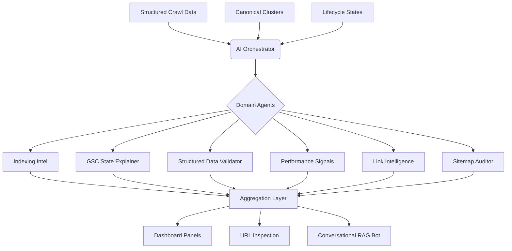
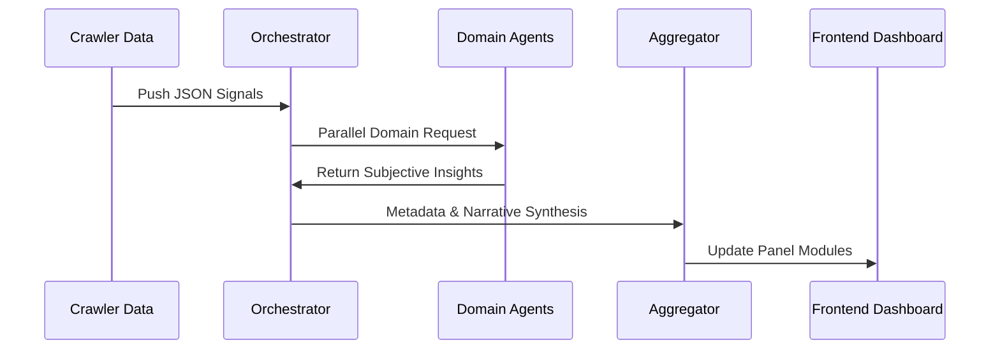

# AI Agent Structure -- Website Intelligence Dashboard

> **Scope:** AI Interpretation Layer & Human-Readable Insight Generation.  
> **Constraint:** Leverages structured crawl data; does NOT perform raw crawling.

> [REVISED] Updated to consume canonical clusters, lifecycle state classifications, and structured data validation states from the crawler and database layers.

---

## Overview

This document defines the AI agent architecture for a crawler-driven website intelligence system designed to power a Google Search Console-like dashboard. The AI layer interprets structured crawl data, explains complex patterns, and generates human-readable narratives for marketing, SEO, and product teams.

**Core Principle:**
> Crawler = Facts | AI Agents = Interpretation, Explanation, and Insights 

---

## 1. High-Level AI Agent Architecture

The system utilizes a multi-agent orchestration pattern where a central controller routes data to domain-specific analytical agents.

---

## 2. Agent Module Specifications

### 2.1 AI Orchestrator (Central Brain)
Acts as the master controller that coordinates specialized agents and ensures unified site-level context.

| Responsibility | Detail |
| :--- | :--- |
| **Routing** | Directs relevant JSON fragments to specialized agents. |
| **Aggregation** | Merges parallel outputs into cohesive dashboard panels. |
| **Memory** | Maintains conversational context for the RAG chatbot. |
| **Normalization** | Ensures consistent tone and depth across all AI summaries. |

---

### 2.2 Indexing Intelligence Agent
Explains indexing and coverage behavior using crawler-derived signals such as robots meta, canonicals, depth, and canonical clusters.

> [REVISED] This agent now consumes canonical cluster data and lifecycle state distributions to generate GSC-aligned coverage explanations.

*   **Scope:** Indexable vs. Non-indexable patterns, Crawled but not indexed, Discovered but weak pages, canonical cluster analysis.
*   **Canonical Cluster Consumption:** The agent receives canonical clusters (groups of URLs sharing a resolved canonical) and evaluates cluster health:
    *   **Healthy Cluster:** All alternates correctly point to the cluster head. No action needed.
    *   **Canonical Mismatch:** The crawler's resolved canonical differs from the declared tag. Generates: *"Duplicate, crawler chose different canonical than user."*
    *   **Missing Canonical:** Duplicate content detected but no `rel=canonical` declared. Generates: *"Duplicate without canonical -- Google may select an arbitrary version."*
    *   **Chain Conflict:** Transitive canonical chains detected (A --> B --> C). Generates: *"Canonical chain detected: consolidate to a single target."*
*   **Analysis:** Soft 404 detection, redirect clusters, duplicate canonical conflicts, and lifecycle state distribution summaries.
*   **Example Outputs:**
    *   *"A large portion of non-indexed pages are low-content sections with high crawl depth and weak internal linking."*
    *   *"142 product pages declare /products/widget as canonical, but the crawler resolved /products/widget?ref=main based on internal link volume."*
    *   *"23% of crawled URLs are in the 'Crawled -- Currently Not Indexed' state, predominantly from the /archive/ directory."*

---

### 2.3 URL Classification Explanation Agent (GSC State Mapper)
Translates technical URL lifecycle states into human-readable explanations, mapped to the formalized GSC state model.

> [REVISED] The agent now maps to the full set of GSC-compatible lifecycle states defined in the URL Lifecycle State Model (Web Crawler Engine, Section 6).

#### Supported Lifecycle States

| Lifecycle State | Agent Explanation Template |
| :--- | :--- |
| `Discovered -- Not Crawled` | *"This URL was found but not fetched. Reason: [budget exhausted / low priority / politeness delay]."* |
| `Crawled -- Currently Not Indexed` | *"This URL was fetched but is unlikely to be indexed due to [thin content / deep depth / low inbound links]."* |
| `Index-Eligible` | *"This URL passes all indexing checks and is eligible for search results."* |
| `Duplicate without Canonical` | *"This URL has content identical to [other URL], but neither page declares a canonical. Search engines may choose arbitrarily."* |
| `Duplicate -- Canonical Mismatch` | *"This URL declares [declared canonical] as its canonical, but the crawler determined [resolved canonical] is the true canonical based on [signals]."* |
| `Alternate with Proper Canonical` | *"This URL correctly points to [canonical URL] as its canonical. It is a valid alternate version."* |
| `Soft 404` | *"This URL returned HTTP 200 but contains [minimal content / error template]. Search engines treat this as a soft 404."* |
| `Blocked by Robots` | *"This URL is disallowed by robots.txt. It cannot be crawled or indexed."* |
| `Excluded by Noindex` | *"This URL contains a noindex directive in [meta tag / X-Robots-Tag header]. It is excluded from indexing by owner intent."* |
| `Redirected Page` | *"This URL returns a [301/302] redirect to [target URL]. The redirect target is tracked separately."* |
| `Error Page (5xx / Timeout)` | *"This URL returned a server error [status code]. The server may be overloaded or the page may be broken."* |
| `Not Found (404)` | *"This URL returned HTTP 404. The page does not exist or has been removed."* |

*   **Outcome:** Each URL in the dashboard displays a clear, non-technical explanation of why it is in its current state, along with the resulting business impact and recommended action.

---

### 2.4 Structured Data & Enhancements Agent
Analyzes JSON-LD validity and optimization opportunities across the site.

> [REVISED] Now consumes the three-tier validation state (`valid`, `warning`, `invalid`) from the structured data table.

*   **Scope:** Breadcrumbs, FAQ, Product, Review snippets, and Organization schema.
*   **Validation State Consumption:** The agent reads `validation_state` per schema type per page and generates:
    *   **Valid:** No action needed. Eligible for rich results.
    *   **Warning:** *"FAQ schema on /faq is parseable but missing the recommended 'datePublished' field."*
    *   **Invalid:** *"Product schema on /products/widget has a malformed JSON-LD block: missing required '@type' property."*
*   **Analysis:** Identifies missing schema opportunities, explains unprocessable data errors, and aggregates validation states by schema type and directory.
*   **Insight Examples:**
    *   *"Most product pages lack valid Price schema, leading to poor rich result eligibility."*
    *   *"83% of FAQ pages have valid schema, but 12 pages have invalid JSON-LD that will prevent rich results."*

---

### 2.5 Link Intelligence Agent
Maps the internal link ecosystem to explain authority flow and discoverability.

*   **Scope:** Internal/External distribution, Orphan pages, Authority silos.
*   **Key Logic:** Correlates link depth with indexing status to find "buried" strategic pages.
*   **Insight Example:** *"Strategic service pages are buried at Depth 5+, receiving 80% less link equity than blog archives."*

---

### 2.6 Performance & Web Signal Interpreter
Interprets crawl-time performance signals (Latency, TTFB, Asset Weight).

*   **Logic:** Clusters slow pages by template or directory rather than individual URLs.
*   **Thresholds:** Flags weight-heavy templates (large images/scripts) affecting crawl efficiency.

---

### 2.7 URL Inspection Agent (Deep Dive)
Powers the individual "URL Inspection" feature with single-page narrative intelligence.

| Metric | Interpretation |
| :--- | :--- |
| **Depth** | Analyzes how many clicks from home it takes to reach the page. |
| **Health** | Summarizes technical status, canonicals, and indexability. |
| **Discovery** | Explains exactly how the crawler found the URL (Sitemap vs Link). |

---

## 3. The Website Insight Narrator (Executive Layer)

This agent generates high-level, marketing-friendly summaries for the main dashboard view. It converts raw metrics into **strategic storytelling.**

*   **Content Patterns:** "The site is dominated by thin categorical pages."
*   **Technical Health:** "Indexation is healthy, but structural depth is hindering new content discovery."
*   **Opportunities:** "Optimizing the footer link structure could surface 500+ orphan pages."

---

## 4. Conversational Chatbot (RAG Agent)

Enables natural language querying of the crawl dataset without hallucinations.

*   **Architecture:** Retrieval-Augmented Generation (RAG) over the structured crawl database.
*   **Safety:** Grounded strictly in factual crawl signals and agent-generated summaries.
*   **Supported Queries:** "Why are my blog pages not indexing?" or "Show me all pages missing FAQ schema."

---

## 5. Intelligence Data Flow

---

## 6. Key Design Principles

1.  **Explanation First:** Avoid raw scores; prioritize explaining the *reasoning* behind the metric.
2.  **Modular Scalability:** New agents (e.g., Core Web Vitals Agent) can be plugged in without refactoring.
3.  **Deterministic Grounding:** AI interpretation is always tied to a physical crawl signal (no hallucinated URLs).
4.  **Cluster Analysis:** Focus on page templates and directories rather than individual URL noise.
5.  **GSC State Alignment:** All agent outputs map to the formalized URL lifecycle state model, ensuring consistent terminology across the crawler, database, and dashboard. [NEW]
6.  **Canonical Truth Awareness:** Agents distinguish between declared and resolved canonicals, surfacing mismatches as actionable diagnostics. [NEW]

---

## 7. Final Summary

The AI agent system acts as the **Intelligence Translation Layer** between raw crawl data and the end-user. By specializing in specific domains like Indexing, Links, and Enhancements, the system provides a Google Search Console-like experience that is explainable, actionable, and grounded in site-wide facts.

> [EXPANDED] The agent layer now:
> - Consumes canonical cluster data to generate mismatch and chain conflict diagnostics.
> - Maps all URL classifications to the formalized GSC lifecycle state model.
> - Consumes three-tier structured data validation states (`valid`, `warning`, `invalid`).
> - Produces human-readable explanation templates for every lifecycle state.
