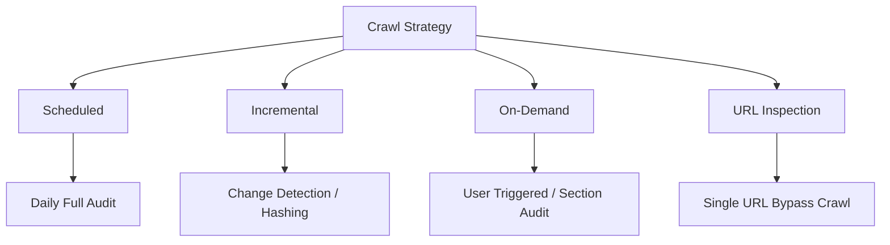
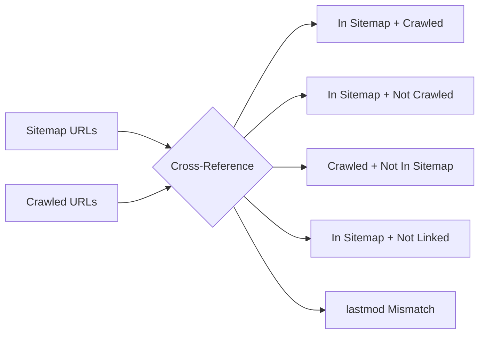

# Crawling Strategies – Web Crawler System

> **Objective:** Maximum Coverage, Controlled Resource Usage, and Real-Time Intelligence.  
> **Approach:** Hybrid multi-tier crawling methodology.

---

## Overview

This document defines the crawling strategies for a large-scale website crawler designed for deep coverage, efficiency, and real-time dashboard updates. The focus is on intelligent patterns, prioritization, and on-demand auditing for high-density environments.

---

## 1. Core Crawling Philosophy

The system rejects "blind" full-site crawling in favor of a hybrid model that balances freshness with resource efficiency.

> [REVISED] The strategy now explicitly separates discovery from crawling and introduces a discovered pool gated by a priority scoring model.



---

## 2. Breadth-First Search (BFS) Traversal

The crawler utilizes a **BFS traversal model** to ensure balanced and structured website coverage, prioritizing the most important pages (shallowest) first.

### BFS Hierarchy
- **Depth 0:** Homepage (Entry Point).
- **Depth 1:** Primary Navigation & Core landing pages.
- **Depth 2:** Category & Main Content pages.
- **Depth 3+:** Deep Internal links & Paginated archives.

### Traversal Benefits
*   **Safety:** Naturally resists getting trapped in deep URL loops (e.g., infinite calendars).
*   **Priority:** Matches search engine patterns by discovering high-equity pages first.
*   **Structure:** Simplifies the "Frontier" queue management with depth-aware scheduling.

---

## 3. Crawl Modalities

### 3.1 Daily Scheduled Crawl (Primary Baseline)
Establishes a reliable baseline dataset for site-wide AI analysis.
*   **Frequency:** Every 24 hours.
*   **Scope:** Full domain crawl (within depth limits), Sitemap reconciliation, and Link Graph refresh.

### 3.2 Incremental Crawling (Change Detection)
Reduces computational overhead by skipping unchanged content.
*   **Logic:** Uses content hashing to detect delta changes.
*   **Triggers:** `lastmod` sitemap updates, new URL discovery, or significant hash mismatches in sampled pages.
*   **Impact:** Reduces redundant crawls by 70-90%.

### 3.3 On-Demand Crawling (High-Priority)
Allows users to trigger immediate audits for specific needs.
| Type | Use Case | Characteristics |
| :--- | :--- | :--- |
| **Site Audit** | Website redesign or migration. | Asynchronous, background processing. |
| **URL Inspection** | Validating technical fixes (e.g., 404 fix). | Instant, bypass crawl (see Web Crawler Engine Section 23). |
| **Sectional Crawl** | Auditing specific directories (e.g., `/blog/*`). | Targeted, high-speed discovery. |

---

## 4. Priority-Aware Frontier Management

The "URL Frontier" (Queue) assigns dynamic priority scores to balance discovery speed.

> [REVISED] Priority ranking now feeds into a formal scoring model that governs transition from the Discovered Pool into the Crawl Queue. See Section 4.1 for the formula.

### Priority Ranking (High to Low)
1.  **Sitemap Entries:** Known "clean" URLs declared by the site owner.
2.  **Home & Navigation:** Core hubs of site equity.
3.  **Recent Updates:** Pages with new `lastmod` or detected changes.
4.  **High-Link Hubs:** Pages with significantly high internal link counts.
5.  **Parameters/Filters:** Faceted navigation and filtered views (lowest priority).

### 4.1 Frontier Priority Scoring Model [NEW]

The transition from the Discovered Pool to the Crawl Queue is governed by a multi-variate scoring model. URLs with the highest composite score are promoted first, subject to the session's remaining crawl budget.

**Scoring Formula:**

```text
priority_score = (w1 * sitemap_signal)
              + (w2 * inbound_link_score)
              + (w3 * depth_penalty)
              + (w4 * freshness_signal)
              + (w5 * historical_change_frequency)
```

| Factor | Description | Default Weight |
| :--- | :--- | :--- |
| `sitemap_signal` | 1.0 if URL is in sitemap with high priority, 0.0 otherwise. Scaled by sitemap `<priority>`. | w1 = 0.25 |
| `inbound_link_score` | Normalized count of internal links pointing to this URL. | w2 = 0.30 |
| `depth_penalty` | Inverse of crawl depth. Shallower pages score higher. `1 / (1 + depth)` | w3 = 0.20 |
| `freshness_signal` | 1.0 if `lastmod` within the last recrawl window, decaying otherwise. | w4 = 0.15 |
| `historical_change_frequency` | Average change rate observed across previous sessions. Higher churn = higher priority. | w5 = 0.10 |

**Budget Gate Logic:**
*   URLs are sorted by `priority_score` descending.
*   The top N URLs (where N = remaining crawl budget) are promoted to the Crawl Queue.
*   Remaining URLs stay in the Discovered Pool with state `Discovered – Not Crawled`.
*   Weights are configurable per crawl profile.

---

## 5. Stability & Politeness Controls

### 5.1 Smart Recrawl Tiers
Instead of uniform recrawling, the system applies tiered frequencies:

| Page Category | Recrawl Frequency | Rationale |
| :--- | :--- | :--- |
| **Hubs & Key Pages** | Multiple times / Daily | Most likely to change or host new links. |
| **Update-Active Pages** | Daily | Standard content updates. |
| **Static & Archival** | Weekly | Low change probability. |
| **Deep Archives** | Periodic / On-demand | Resource intensive, low immediate value. |

### 5.2 Crawl Budget & Limits
*   **Depth Constraints:** Configurable limits (e.g., max Depth 7) to prevent infinite sprawl.
*   **Total URL Caps:** Hard limits per session to control infrastructure costs.
*   **Concurrency:** Throttled requests per domain to ensure server politeness.
*   **Failure Management:** Exponential backoff for 5xx errors or connection timeouts.
*   **Host Health Integration:** Effective budget is reduced when host health degrades. [NEW]

---

## 6. Sitemap vs. Crawl Reconciliation [NEW]

### Purpose

Google Search Console explicitly surfaces discrepancies between what a site declares in its sitemaps and what the crawler actually discovers and fetches. This section defines the reconciliation logic needed to produce those insights.

### Reconciliation Categories

| Category | Definition | Significance |
| :--- | :--- | :--- |
| **In Sitemap, Crawled** | URL is declared in sitemap and was successfully fetched. | Healthy state. |
| **In Sitemap, Not Crawled** | URL is declared in sitemap but was not fetched (budget, blocked, or deferred). | Indicates crawl budget issues or robots exclusion. |
| **Crawled, Not in Sitemap** | URL was discovered via links or other means and fetched, but is absent from all sitemaps. | Site owner may have forgotten to include it, or it may be intentionally unlisted. |
| **In Sitemap, Not Linked** | URL is declared in sitemap but has zero inbound internal links from other crawled pages. | Orphan page candidate (see Section 6.1). |
| **lastmod Mismatch** | Sitemap `lastmod` timestamp does not correlate with observed content changes (hash unchanged despite recent lastmod, or hash changed but lastmod is stale). | Indicates unreliable sitemap freshness signals. |

### Reconciliation Workflow



### Data Requirements
*   The sitemap URL set and the crawled URL set must both be stored per session.
*   The internal link graph must be queryable to determine inbound link counts per URL.
*   `lastmod` values from sitemaps and `page_hash` values from crawled pages must be comparable.

### 6.1 Orphan Page Identification [NEW]

An **orphan page** is a URL that exists (and may be important) but has no path from the site's internal navigation.

**Identification Rules:**
1.  URL is present in the sitemap (site owner considers it important).
2.  URL has **zero inbound internal links** from any page discovered in the current crawl session.
3.  URL was not discovered through any link-based discovery source (only through the sitemap or manual seed).

**Classification:**
*   URLs meeting all three rules are flagged as `orphan_candidate`.
*   URLs meeting rules 1-2 but discovered via a redirect chain are flagged as `orphan_redirect` (the original link target may have moved).

**Impact:** Orphan pages feed into the AI Link Intelligence Agent to generate recommendations like *"47 product pages are listed in the sitemap but have no internal links. They are effectively invisible to crawlers relying on link discovery."*

---

## 7. URL Pattern Trap Detection [NEW]

### Purpose

Large websites frequently generate infinite crawl spaces through query parameters, session identifiers, and pagination patterns. The crawler must detect and neutralize these traps to preserve crawl budget for meaningful content.

### Trap Patterns

| Pattern Type | Example URLs | Detection Signal |
| :--- | :--- | :--- |
| **Pagination explosion** | `/products?page=1`, `/products?page=2`, ... `/products?page=9999` | Incrementing numeric parameter with high cardinality. |
| **Sort/Filter combinatorics** | `/products?sort=price&color=red&size=m` | Combinatorial parameter growth producing near-duplicate content. |
| **Session/Tracking IDs** | `/page?sid=abc123`, `/page?utm_source=...` | Parameter values that change per request but content is identical. |
| **Calendar/Date loops** | `/events/2026/01/01`, `/events/2026/01/02`, ... | Date-based path segments with unbounded range. |
| **Infinite scroll anchors** | `/feed#offset=100`, `/feed#offset=200` | Fragment or parameter-based offset with no upper bound. |

### Detection Logic

1.  **URL Pattern Signatures:** Group URLs by their path structure (ignoring parameter values). When a single pattern generates more URLs than a configurable threshold (e.g., 50), flag it as a potential trap.
2.  **Content Entropy Analysis:** Sample pages from the pattern group and compare content hashes. If content similarity exceeds a threshold (e.g., 90%), the parameter variations are producing near-duplicates.
3.  **Parameter Value Cardinality:** Track the number of unique values for each query parameter. Parameters with cardinality > N (configurable) that produce similar content are classified as trap parameters.

### Response Actions
*   **Auto-cap:** Limit crawling to the first N URLs matching a trap pattern signature.
*   **Parameter stripping:** Remove identified trap parameters before frontier insertion.
*   **Logging:** Log all trap detections for review and configuration tuning.
*   **State assignment:** Trap-affected URLs that are blocked from crawling receive a note in their lifecycle state metadata.

---

## 8. Large-Scale Link Graph Optimization

For sites with millions of internal links, the crawler implements:
*   **Deduplication:** Hash-based URL comparison.
*   **Template De-weighting:** Ignoring repetitive headers/footers to find unique content links.
*   **Normalization:** Standardizing trailing slashes and parameter casing.
*   **Loop Protection:** Detecting and killing infinite pagination loops.
*   **Orphan Integration:** Cross-referencing the link graph with sitemap data for orphan detection (see Section 6.1). [NEW]

---

## 9. Final Strategy Summary

The crawling strategy integrates **BFS-based discovery** with a **Priority Queue Frontier** to achieve deep site coverage without excessive resource waste. By layering scheduled full audits with incremental change detection and user-triggered inspections, the system maintains a fresh, high-fidelity intelligence dataset suitable for professional GSC-style dashboards.

> [EXPANDED] The strategy now includes:
> *   Sitemap vs. Crawl reconciliation with orphan page detection.
> *   URL pattern trap detection and parameter stripping.
> *   A formal priority scoring model governing the Discovered Pool to Crawl Queue transition.
> *   Host health-aware budget enforcement.
